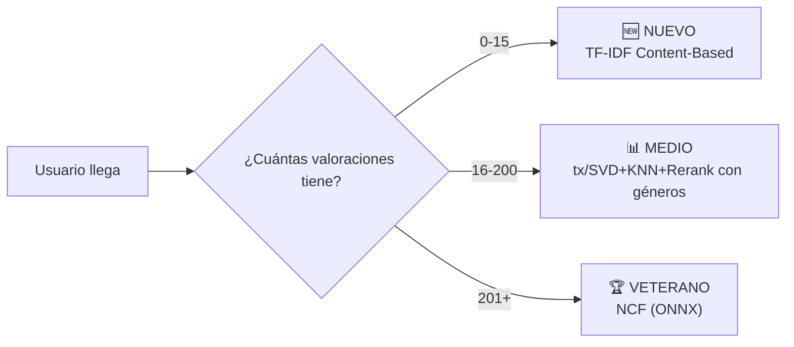

# 🎬 Auditoría Completa del Proyecto Streaming — Modelos, Evaluación y Tracking

---

## 1. Inventario Completo de Modelos

### 📁 Carpeta `jj/` — 7 modelos + artefactos entrenados

| # | Archivo | Tipo | Librería | Datos de Entrada | Filtro mínimo | Métricas calculadas | Artefactos generados |
|---|---------|------|----------|------------------|---------------|---------------------|----------------------|
| 1 | `modelo_1_SVD.py` | Filtrado Colaborativo (Factorización matricial) | scikit-surprise | ratings explícitos | ≥20 ratings/usuario | RMSE, MAE | `.pkl`, `.joblib` |
| 2 | `modelo_2_knn+cs.py` | Filtrado Colaborativo (Vecinos — Coseno) | scikit-surprise `KNNBasic` | ratings explícitos | ≥50 user, ≥150 item | RMSE, MAE | `.pkl`, `.joblib` |
| 2.5 | `modelo_2.5_knn_msd.py` | Filtrado Colaborativo (Vecinos — MSD + GridSearch) | scikit-surprise `KNNWithMeans` | ratings explícitos | ≥50 user, ≥150 item | RMSE, MAE | `.pkl`, `.joblib` |
| 3 | `modelo_3_wide&deep.py` | Deep Learning Híbrido (Wide+Deep) | PyTorch + ONNX | ranking binario (neg sampling) | **≥1000 user, ≥1000 item** | Accuracy (ranking) | `.pth`, `.onnx` |
| 4 | `modelo_4_bcs_tf-idf.py` | Content-Based (TF-IDF) | scikit-learn | texto catálogo (sinopsis+géneros) | Ninguno | Ninguna directa | `.pkl` (vectorizer, matrix, indices) |
| 5 | `modelo_5_implicit.py` | Filtrado Colaborativo Implícito (BPR) | implicit | interacciones positivas (rating≥3.5) | Ninguno | Ninguna (evita bug Cython Windows) | `.pkl` (model + dataset) |
| 6 | `modelo_6_ncf.py` | Deep Learning (GMF+MLP fusionados) | PyTorch + ONNX | ranking pairwise (BCE) | **≥200 user, ≥100 item** (K-Core iterativo) | Ninguna interna | `.onnx`, `.json` mappings |
| 7 | `modelo_7_twotowers.py` | Deep Learning (Bi-Encoder) | PyTorch + ONNX | in-batch negatives | **≥1000 user, ≥1000 item** | Loss final | `.pth`, `.onnx` |

### 📁 Carpeta `nil/` — 3 scripts

| Archivo | Qué hace | Modelos internos | ¿Duplicado de jj? |
|---------|----------|------------------|---------------------|
| `benchmark_modelos.py` | Benchmark comparativo completo | **BPR-MF**, **NCF-Lite**, **LightGCN** | NCF-Lite ≈ `jj/modelo_6_ncf.py`; BPR-MF ≈ concepto de `jj/modelo_5`; **LightGCN es NUEVO** |
| `train_modelo_ncf.py` | Pipeline de entrenamiento NCF-Lite para producción | NCF-Lite | **Duplicado directo** de `jj/modelo_6_ncf.py` (mismo modelo, distinto estilo de código) |
| `evaluar_modelo_final.py` | Evaluación final con RMSE/MAE/NDCG@10/Precision@10 | NCF-Lite (entrena + evalúa) | Evaluación propia, **no** usa `evaluation_pipeline.py` |

### 📁 Carpeta `tx/` — 2 scripts

| Archivo | Qué hace | Algoritmos | ¿Duplicado? |
|---------|----------|------------|-------------|
| `model_SVD_KNN_RERANK.py` | Pipeline SVD→KNN→Re-rank (vote_avg) | sklearn `TruncatedSVD` + `NearestNeighbors` (coseno) | Similar a jj/SVD+KNN pero implementación **completamente distinta** (sklearn vs surprise), con re-ranking por puntuación TMDB |
| `model_SVD_KNN_RERANK_con_generos.py` | Igual que el anterior + re-rank por afinidad de géneros del usuario | sklearn `TruncatedSVD` + `NearestNeighbors` + perfil de géneros | **Evolución del anterior**, más sofisticado con features de catálogo |

---

## 2. Análisis Comparativo Profundo

### 🏆 Ranking de los Modelos (de MEJOR a PEOR para producción)

```
┌─────┬─────────────────────────────────────┬───────────┬──────────────┬───────────────────────┐
│ Pos │ Modelo                              │ Fortaleza │ Debilidad    │ Caso de uso ideal     │
├─────┼─────────────────────────────────────┼───────────┼──────────────┼───────────────────────┤
│  1  │ tx/SVD+KNN+Rerank (con géneros)     │ Híbrido CF│ No tiene DL  │ Usuarios medios       │
│     │                                     │ + Content │              │ (11-100 ratings)      │
│  2  │ jj/NCF (modelo_6)                   │ No-lineal │ Necesita >200│ Usuarios veteranos    │
│     │ ≡ nil/NCF-Lite                      │ GPU ready │ ratings      │ (>100 ratings)        │
│  3  │ jj/SVD (modelo_1)                   │ Rápido,   │ Lineal,no    │ Usuarios medios       │
│     │                                     │ probado   │ content      │ (11-100 ratings)      │
│  4  │ nil/LightGCN                        │ SOTA graph│ Solo en bench│ Potencial estrella    │
│     │                                     │ propagat. │ no integrado │ (a investigar)        │
│  5  │ jj/TF-IDF (modelo_4)               │ Cold start│ No CF        │ Usuarios nuevos       │
│     │                                     │ perfecto  │              │ (0-10 ratings)        │
│  6  │ jj/Implicit BPR (modelo_5)          │ Rápido,   │ Bug Windows  │ Usuarios medios       │
│     │                                     │ implícito │ no evaluado  │ (alternativa)         │
│  7  │ jj/KNN MSD (modelo_2.5)            │ GridSearch│ Pesado RAM   │ Reemplazado por tx/   │
│  8  │ jj/KNN Cosine (modelo_2)           │ Simple    │ Peor RMSE    │ Redundante            │
│  9  │ jj/Wide&Deep (modelo_3)            │ Googl arch│ 1000 min!    │ Necesita ajustar min  │
│ 10  │ jj/Two-Towers (modelo_7)           │ Retrieval │ 1000 min!    │ Necesita ajustar min  │
│ 11  │ nil/BPR-MF                          │ En bench  │ No exportado │ Solo análisis         │
└─────┴─────────────────────────────────────┴───────────┴──────────────┴───────────────────────┘
```

### 🔍 Modelos Duplicados / Superpuestos

> [!IMPORTANT]
> Hay **3 pares de duplicados** que deben simplificarse:

#### 1. **NCF: `jj/modelo_6_ncf.py` ≡ `nil/train_modelo_ncf.py` ≡ `nil/benchmark_modelos.py::NCFLite`**
Tres implementaciones idénticas en concepto (GMF+MLP con BCE pairwise). El de `nil/` tiene mejor calidad de código (documentación, CLI args, logging profesional). \
**👉 Recomendación**: Adoptar **`nil/train_modelo_ncf.py`** como script oficial de entrenamiento NCF. Mantener `jj/modelo_6_ncf.py` solo si ya hay un ONNX entrenado que funcione en la API.

#### 2. **SVD+KNN: `jj/modelo_1 + modelo_2/2.5` vs `tx/model_SVD_KNN_RERANK`**
JJ usa scikit-surprise (modelos separados). TX usa sklearn (pipeline unificado con re-ranking). \
**👉 Recomendación**: Para el grupo de usuarios medios, usar **`tx/model_SVD_KNN_RERANK_con_generos.py`** porque fusiona SVD+KNN+features de catálogo en un solo recommender coherente.

#### 3. **BPR: `jj/modelo_5_implicit.py` vs `nil/benchmark_modelos.py::BPRMF`**
JJ usa la librería `implicit`, NIL implementa BPR-MF en PyTorch puro. \
**👉 Recomendación**: `jj/modelo_5` es más práctico para producción (librería optimizada en C++). El de NIL es solo para benchmark.

---

## 3. Estrategia de Clusterización de Usuarios

> [!TIP]
> La estrategia de 3 clusters sigue siendo la **correcta**, pero hay que ajustar los umbrales y los modelos finales.

### Umbrales Propuestos (Ajustados)



| Grupo | Rango | Modelo recomendado | Justificación |
|-------|-------|--------------------|---------------|
| **Nuevo** | 0–15 valoraciones | `jj/modelo_4_bcs_tf-idf.py` | Único modelo que funciona sin historial. Fallback a popularidad si 0 interacciones. |
| **Medio** | 16–200 valoraciones | `tx/model_SVD_KNN_RERANK_con_generos.py` | Combina CF (SVD → latent space → KNN vecinos) con features de catálogo (géneros, vote_avg). Funciona bien con historial moderado. |
| **Veterano** | 201+ valoraciones | `jj/modelo_6_ncf.py` (ONNX) | Las no-linealidades del NCF capturan patrones complejos cuando hay suficientes datos. ONNX permite inferencia rápida sin PyTorch. |

### ¿Por qué estos umbrales y no los de antes?

> [!WARNING]
> El Wide & Deep y Two Towers actuales entrenan con **MIN_RATINGS = 1000**, lo cual es el problema principal.

- **15 en vez de 10**: Con 10 ratings, los modelos CF aún generan recomendaciones muy ruidosas. 15 da un mínimo de señal estadística.
- **200 en vez de 100**: El NCF de jj/ está entrenado con K-Core de 200 para usuarios. Si bajamos a 101, necesitamos **reentrenar el NCF con `MIN_RATINGS_USER=101`** y verificar que la calidad no degrade.
- **El grupo de Wide&Deep con 1000 no es viable**: Solo ~2.5% de los usuarios tienen 1000+ valoraciones. Es un modelo que aísla demasiado.

### Acción requerida sobre Wide&Deep / Two-Towers

Para hacerlos viables como alternativa a NCF:
1. **Bajar `MIN_RATINGS_USUARIO` a 50-100** en `modelo_3_wide&deep.py` y `modelo_7_twotowers.py`
2. **Bajar `MIN_RATINGS_PELICULA` a 50-100**
3. **Reentrenar** y comparar métricas contra NCF
4. Si el Wide&Deep supera al NCF con estos nuevos umbrales → sustituir como modelo veterano

---

## 4. Problemas Detectados en Evaluación y Tracking

### 4.1 Evaluador Actual (`evaluacion_ranking.py`)

> [!CAUTION]
> El evaluador actual tiene **varias lagunas graves**:

| Problema | Detalle |
|----------|---------|
| **Filtro de ≥1000 ratings** | Solo evalúa "cinéfilos" con 1000+ ratings. No mide rendimiento real para usuarios medios/nuevos |
| **No evalúa tx/modelos** | Los modelos de TX (`SVD+KNN+Rerank`) no están incluidos en la evaluación |
| **No evalúa nil/LightGCN** | LightGCN (potencialmente el mejor) no se evalúa |
| **No registra al CSV** | La evaluación de ranking produce `metricas_ranking.csv` pero **no llama a `registrar_metricas()`** para el `historial_metricas.csv` |
| **Métricas disjuntas** | JJ registra RMSE/MAE al entrenar, pero las métricas de ranking (NDCG, Precision, Recall) se calculan aparte y no se cruzan |
| **Falta MAE/RMSE en modelos de ranking** | NCF, Wide&Deep, Two-Towers no calculan RMSE/MAE (correcto conceptualmente, pero la rúbrica pide comparación) |

### 4.2 Pipeline de Evaluación (`evaluation_pipeline.py`)

El `EvaluationPipeline` está **bien diseñado** (patrón Strategy con `MetricProtocol`), pero:
- Solo se invoca desde `evaluacion_ranking.py` y solo para los modelos de jj/
- No tiene hook para registrar resultados en `historial_metricas.csv`
- Le falta una métrica: **MRR@K** (Mean Reciprocal Rank) que sí está en las columnas del CSV

### 4.3 Registro de Métricas (`registrar_metricas.py`)

- El CSV tiene columnas para ranking (NDCG_10, Precision_10, etc.) pero **ningún modelo las rellena**
- Los modelos de jj/ sí llaman a `registrar_metricas()` al entrenar, pero solo pasan MAE/RMSE
- Los modelos de nil/ y tx/ **NO llaman nunca** a `registrar_metricas()`

### 4.4 Tracking Logger (`tracking/logger.py`)

- Funciona correctamente para logging de inferencia (recomendaciones servidas en la API)
- Es **complementario** al registro de métricas, no un sustituto
- No debe mezclarse con el tracking de entrenamiento/evaluación

---

## 5. Plan de Implementación

### Fase 1: Unificar la Evaluación (Prioridad ALTA)

#### 1.1 Ampliar `evaluation_pipeline.py`

Añadir un método `register_to_csv()` que tras evaluar un modelo, llame a `registrar_metricas()` con las métricas de ranking obtenidas:

```python
# En evaluation_pipeline.py — NUEVO método
def register_results_to_csv(self, model_name: str, hiperparams: dict = None, 
                             dataset_size: int = None, train_time_s: float = None):
    """Registra los resultados de la última evaluación en historial_metricas.csv"""
    if model_name not in self.results:
        return
    
    metricas_ranking = {}
    mapping = {
        "PrecisionAtK": "Precision_10",
        "RecallAtK": "Recall_10", 
        "HitRateAtK": "Hit_Rate_10",
        "NDCGAtK": "NDCG_10",
        "CoverageAtK": "Coverage_10",
    }
    for metric_class_name, csv_col in mapping.items():
        if metric_class_name in self.results[model_name]:
            metricas_ranking[csv_col] = self.results[model_name][metric_class_name]
    
    registrar_metricas(
        modelo=model_name,
        hiperparams=hiperparams or {},
        metricas=metricas_ranking,
        dataset_size=dataset_size,
        train_time_s=train_time_s,
    )
```

#### 1.2 Ampliar `evaluacion_ranking.py`

- Incluir **modelos de tx/** en la evaluación
- Bajar el filtro de usuarios de 1000 a **algo representativo por grupo** (crear evaluaciones por cluster)
- Llamar a `pipeline_juez.register_results_to_csv()` tras evaluar cada modelo

#### 1.3 Añadir métrica MRR@K

Crear `src/metrics/mrr.py` siguiendo el mismo `MetricProtocol` que las demás.

### Fase 2: Ajustar Umbrales de Entrenamiento (Prioridad MEDIA)

1. **Reentrenar Wide&Deep** con `MIN_RATINGS_USUARIO=100`, `MIN_RATINGS_PELICULA=50`
2. **Reentrenar Two-Towers** con los mismos umbrales
3. **Reentrenar NCF** con `MIN_RATINGS_USER=50`, `MIN_RATINGS_ITEM=50`
4. Comparar las 3 arquitecturas DL con las mismas condiciones

### Fase 3: Evaluación Comparativa Final (Prioridad ALTA)

Ejecutar la evaluación unificada con **3 grupos de usuarios** para validar la estrategia de clustering:

```
Grupo Nuevo   (0-15 ratings)  → evaluar TF-IDF vs popularidad
Grupo Medio   (16-200 ratings) → evaluar SVD, KNN, tx/Rerank, Implicit
Grupo Veterano (201+ ratings)  → evaluar NCF, Wide&Deep, Two-Towers, LightGCN
```

---

## 6. Tracking: ¿CSV o MLflow?

> [!IMPORTANT]
> **Recomendación: Mantener CSV como sistema primario** para este proyecto académico.

### Argumentos a favor de CSV (manteniéndolo):

| Ventaja | Detalle |
|---------|---------|
| **Ya funciona** | `registrar_metricas.py` ya está integrado en 5 de 7 modelos |
| **Cero config** | No requiere servidor, base de datos, ni dependencias extra |
| **Rúbrica** | El proyecto se evalúa por entregables visibles. Un CSV es más rápido de enseñar que un setup de MLflow |
| **Git-friendly** | Se versiona directamente con el código |

### ¿Cuándo sí usaría MLflow?

Si el proyecto escala a producción real (servidor dedicado, reentrenamiento automático, A/B testing). Para un entregable académico, MLflow añade complejidad sin beneficio proporcionado.

### Plan de tracking definitivo:

```
┌─────────────────────────────────┐
│  Entrenamiento de modelo        │
│  (modelo_X.py)                  │
│  → registrar_metricas() al CSV  │ ← Ya existe, solo completar nil/ y tx/
└──────────┬──────────────────────┘
           │
           ▼
┌─────────────────────────────────┐
│  Evaluación de ranking          │
│  (evaluacion_ranking.py)        │
│  → EvaluationPipeline           │
│  → register_results_to_csv()    │ ← NUEVO: que grabe al mismo CSV
└──────────┬──────────────────────┘
           │
           ▼
┌─────────────────────────────────┐
│  historial_metricas.csv         │
│  (fuente única de verdad)       │ ← Todo centralizado aquí
└──────────┬──────────────────────┘
           │
           ▼
┌─────────────────────────────────┐
│  Inferencia API                 │
│  (main_api.py)                  │
│  → RecommendationLogger         │ ← Ya funciona para logs de servido
│  → logs/recommendations.jsonl   │
└─────────────────────────────────┘
```

---

## 7. Resumen de Acciones Pendientes

| # | Acción | Prioridad | Estado |
|---|--------|-----------|--------|
| 1 | Decidir modelos definitivos por cluster | 🔴 ALTA | ✅ Decidido |
| 2 | Ampliar `evaluation_pipeline.py` con `register_results_to_csv()` | 🔴 ALTA | ✅ Implementado |
| 3 | Añadir métrica MRR@K en `src/metrics/` | 🟡 MEDIA | ✅ Creado `src/metrics/mrr.py` |
| 4 | Integrar modelos tx/ en `evaluacion_ranking.py` | 🔴 ALTA | ✅ `predecir_tx_rerank()` + TX_RERANK |
| 5 | Reentrenar W&D y Two-Towers con umbrales bajos (100/50) | 🟡 MEDIA | ⏳ Código preparado, falta ejecutar (GPU) |
| 6 | Reentrenar NCF con umbrales 50/50 | 🟡 MEDIA | ⏳ Pendiente (GPU) |
| 7 | Añadir `registrar_metricas()` a modelos nil/ y tx/ | 🟢 BAJA | ✅ 4 archivos actualizados |
| 8 | Ejecutar evaluación comparativa final por clusters | 🔴 ALTA | ⏳ Pendiente |
| 9 | Limpiar modelos duplicados (dejar uno por concepto) | 🟢 BAJA | ❌ Descartado (el usuario prefiere conservar todos) |

### Cambios realizados en código (resumen ejecutivo):

**Archivos nuevos:**
- `src/metrics/mrr.py` — Métrica MRR@K

**Archivos modificados (rutas a `artifacts/`):**
- `src/api/main_api.py`, `src/utils/evaluacion_ranking.py`, `src/utils/exportar_onnx.py`
- 7 modelos de `jj/`, 1 de `nil/`

**Archivos modificados (tracking `registrar_metricas()`):**
- `nil/train_modelo_ncf.py`, `nil/evaluar_modelo_final.py`
- `tx/model_SVD_KNN_RERANK.py`, `tx/model_SVD_KNN_RERANK_con_generos.py`

**Archivos modificados (evaluación + reentrenamiento):**
- `src/utils/evaluacion_ranking.py` — TX integrado + MRR@K + registro CSV automático
- `src/pipelines/evaluation_pipeline.py` — `registrar_resultados_en_csv()`
- `modelo_3_wide&deep.py` — MIN_RATINGS: 1000→100/50, sufijo automático
- `modelo_7_twotowers.py` — MIN_RATINGS: 1000→100/50, sufijo automático

